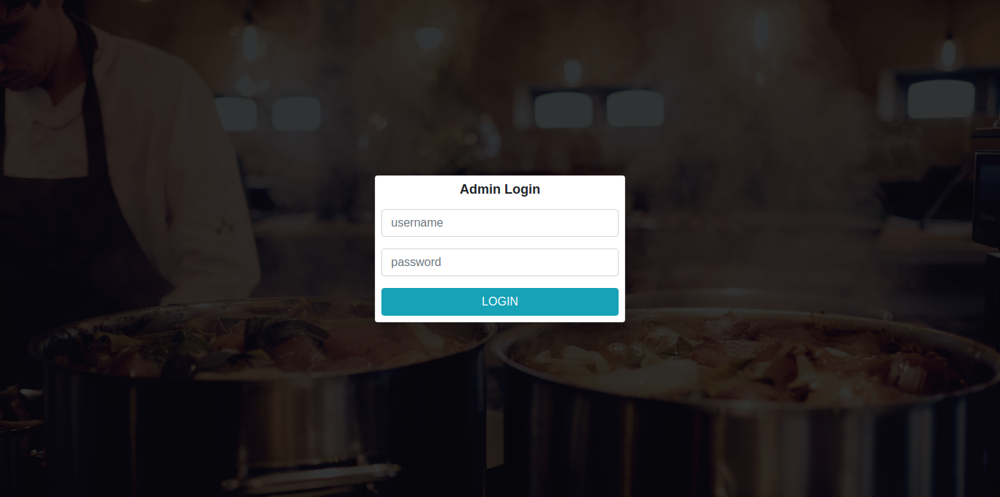

#UPDATE
I am almost done with the menu item page, we will have 2 navs, which are <br> 
category and menu items

##Category
This will have all categories of our food items, like *Breakfast , Lunch and others*<br>
###Menu Item
This will be food items like rice and stuffs, every food item will belong to category


#### How to deploy
* Got to run these queries in your database <br> 
```
create table if not exists `food_category` (
    `id` int auto_increment unique,
    `description` text,
    `date_created` date default current_date(),
    `time_created` time default current_time(),
    `owner` text
);

create table if not exists `menu_items` (
    `id` int auto_increment unique,
    `category` text,
    `description` text,
    `cost_price` double(6,2),
    `retail_price` double(6,2),
    `tax` text,
    `recipe` text,
    `date_created` date default current_time(),
    `time_created` time default current_time(),
    `owner` text

)


```

if you face error that says date_created and tke_created defaults are wrong change those lines to<br>
```
`date_created` text,
`time_created` text
```

* Finally, copy the code in admin and paste replace it with current admin, it will change
